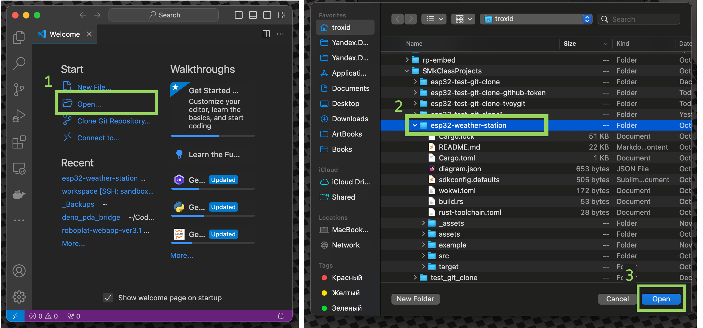
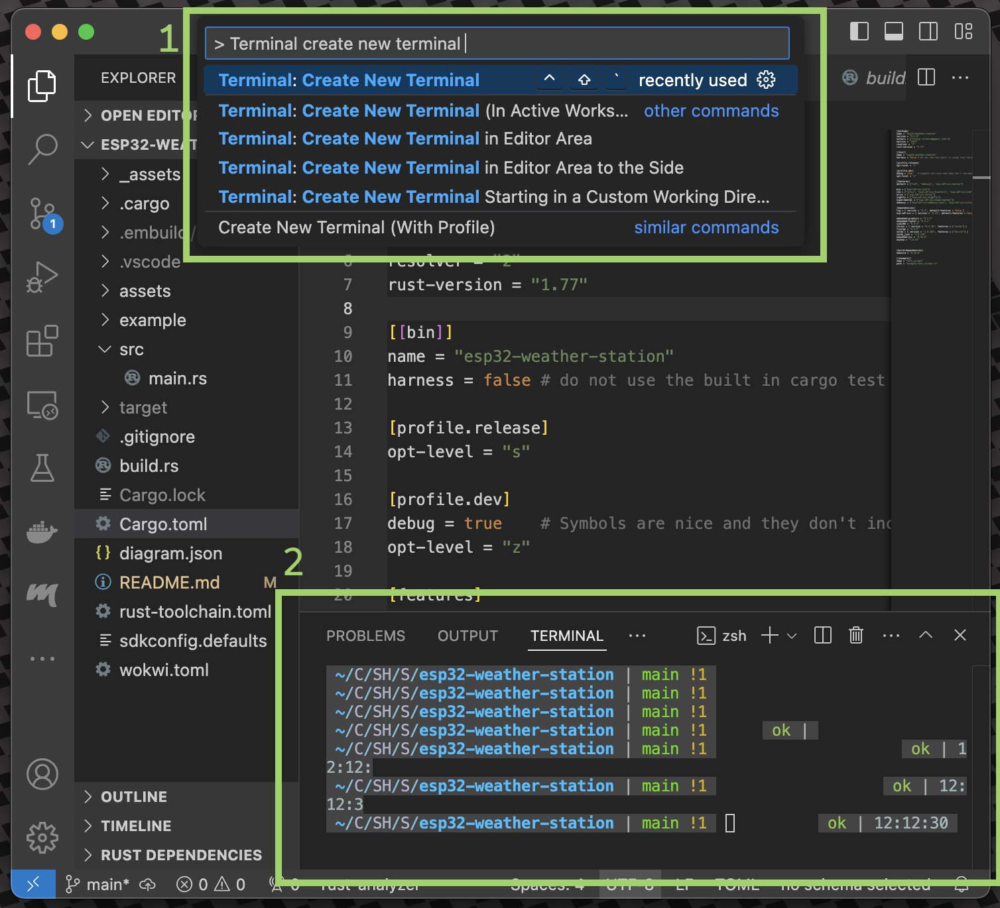

# esp32-weather-station


Простая метеостанция на esp32 + rust, которая показывают актуальную погоду с [open-meteo](https://open-meteo.com/en/docs)

# Необходимые материалы

- Ноутбук/ПК (Linux, MacOS, Windows) для разработки и прошивки МК
- Кабель USB для подключения к МК (ответная часть зависит от девкита)
- Экран PMOLED монохромный на базе контроллера **SSD1306**  
- Devkit на базе микроконтроллера ESP32
- WiFi точка доступа 2.4ГГц с выходом в интернет (для МК)

Купить или использовать можно любые девкиты и экраны, главное что бы 

- экран должен быть на базе **SSD1306** 
- devkit должен быть на базе **ESP32**

Так же необходимо найти и скачать распиновку для своего МК. Гуглится по ключевому слову pinout, например: `pinout ESP32-WROOM-32 NodeMCU`

Примеры комплектов:

## Экран и МК отдельно


> **Warning**  
> Экран и девкит может поставляться с незапаянными штырьковыми разъемами! Может потребоваться пайка

[OLED SSD1306](https://www.ozon.ru/product/oled-displey-0-96-128x64-i2c-belyy-945285571/?avtc=1&avte=4&avts=1731359337)

[ESP32](https://www.ozon.ru/product/esp32-devkit-38pin-kontroller-esp32-wroom-32-1712466151/?asb=4YstCflXD96uqMLauwoLdrpQV2di4mSfafcY9jjcj3o%253D&asb2=bk60acPFqJK_qYXImt6teQC9dRnWb5UyF6-MYuU-WDKcL4FCB2stRmCAlbGafX-QRJ-LY2GJUSmEM0_6cqnxh0jgrXC6epUfEvWqbu-kjzlD2rVar6v3axaYR6WVz9pyqY0gomrz9zUqoeSl8QrVqzW93XDENFbmviQw-9MTRck&avtc=1&avte=4&avts=1731359541&keywords=esp32)

[Макетная плата на 170+ точек](https://www.ozon.ru/product/bespaechnaya-maketnaya-plata-breadboard-170-tochek-1012687498/?asb=ZDxXko1pTvutL5%252Fnh0tgzzfF6WZARy%252FAldmVRp5dI28%253D&asb2=2m27FwpI6os8QJ2bUvzGYKKIc0au6Ac-TJsu2VdWU55Rsg-_DqC2XvKI9Pe-TAwisEFotJ8S3YYK2E_z6lcfiw&avtc=1&avte=4&avts=1731360479&keywords=breadboard)

[Провода перемычки Dupont](https://www.ozon.ru/product/provoda-peremychki-dupont-30-sm-3-vida-po-40-sht-mama-mama-papa-papa-papa-mama-dlya-arduino-1051231534/?asb=riLQ0aCCIN%252B6T6zq6UEbic8gPR18Wndf2Yszn2b3QT4%253D&asb2=FVEu6zkxrJzi6G3g_BwEPUEp0TL1_IzPCrGzr6LAkosND_sPccnNYwZmBDbbhaO0r6n_EZnOLJErxg414yEy_A&avtc=1&avte=4&avts=1731360540&keywords=провода+для+ардуино)


## МК вместе с экраном на плате


В этом комплекте ничего паять и подключать между собой не нужно т.к. все располагается на одной плате.

[Devkit ESP32 + OLED SSD1306](https://www.ozon.ru/product/modul-esp32-s-oled-displeem-1564880460/?asb=PgnFzODZfTizrkdcvDZqZNNEV5%252BCMd23%252F6bvhsValaQ%253D&asb2=gliD0Zr4VXqWYXjIFnckd8Jth5iSS29j_IE9QG8ZCA2v7imw1e6HkU1YJUozNnDuqBbLOfhjWbvyZAQI19PmGA&avtc=1&avte=4&avts=1731359481&keywords=esp32+oled)

# Учебные метериалы 

Rust:  
- [Перевод официальной книги "Язык программирования Rust" (RU)](https://doc.rust-lang.ru/book/title-page.html)  
- [Перевод книги "Rust на примерах" (RU)](https://doc.rust-lang.ru/stable/rust-by-example/index.html)  
- [Шпаргалка синтиаксиса (learn X in Y minutes)](https://learnxinyminutes.com/ru/rust/)  
- [Интерактивный тур по языку](https://tourofrust.com/00_ru.html)
- [Реализация различных алгоритмов на Rust](https://the-algorithms.com/language/rust)

Embedded Rust:  
- [Книга "The Rust on ESP Book" ](https://docs.esp-rs.org/book/introduction.html)
- [Примеры использования ESP-IDF. Базовая перифирия (GPIO, I2C, ADC и т.д.)](https://github.com/esp-rs/esp-idf-hal/tree/master/examples)  
- [Примеры использования ESP-IDF. Сервисы (WiFi, BT, HTTP и т.д.)](https://github.com/esp-rs/esp-idf-svc/tree/master/examples)  
- [Серия статей Rust+ESP32](https://blog.theembeddedrustacean.com/series/esp32c3-embedded-rust-hal)

# Настройка окружения

Для тех у кого уже установлен rust, можно перейти к шагу [3 Установка ESP32 SDK для Rust](README.MD#3-установка-esp32-sdk-для-rust)

## 1 Установка rust 

На главной странице будет скрипт или инсталятор, который необходимо запустить 
```
https://rustup.rs
```

Для Windows машин, необходимо выбрать опцию:
```
1) Quick install via the Visual Studio Community installer
```

После этого будут доступны следующие командные утилиты:  
- `cargo` - пакетный менеджер проектов на rust, запуск и сборка проектов.  
- `rustup` - утилита для обновления тулчеинов, версии компилятора rust, а так же переключение на stable, beta и nightly ветку компилятора.   
- `rustc` - компилятор rust (пользователем напрямую обычно не используется)  

## 2 Установка IDE: 

В этой инструкции будет использоваться редактор vscode.  
Устанавливаем vscode для своей операционной системы:
```
https://code.visualstudio.com
```

а так же расширение для языка rust
```
https://code.visualstudio.com/docs/languages/rust
```

Так же есть поддержка IDE Jetbrains и любых редкаторов, у которых есть поддержка LSP ([более подробно](https://rust-analyzer.github.io/manual.html)):  
[RustRover(Jetbrains)](https://www.jetbrains.com/rust/)  
[zed](https://zed.dev)  


## 3 Установка ESP32 SDK для Rust
[полная инструкция](https://github.com/esp-rs/esp-idf-template#prerequisites)  
Для компиляции и прошивки микроконтроллеров на базе esp32 необходимо установить ряд дополнительных утилит:  
- `espflash` - работа с flash памятью и прошивка микроконтроллера  
- `ldproxy` - утилита для перенаправления аргументов линковщика (не используется пользователем напрямую).    
- `espup` - утилита для установки тулчеинов (Xtensa Rust toolchain)  
- `esp-idf` - Содержит API (библиотеки и исходный код) для доступа к перефирии МК + скрипты для работы с тулчеином.  
- `cargo-generate` - создание rust проектов на базе репозиториев-шаблонов

Установка данных утилит выполняется один раз и используется для всех последующих проектов.  
При сборке проекта будет использоваться обычная команда `cargo run` и в большинстве случаев, ручной вызов этих утилит не требуется.


### esp-idf 

Необходимо установить **только** дополнительные пакеты для своей ОС (команды `sudo apt-get install`, `brew install` и тд).  
Выполняется **только шаг 1** "Step 1. Install Prerequisites".  
Шаги "Step 2. Get ESP-IDF" и "Step 3. Set up the Tools" выполнять **не нужно**.   

[Step 1. Install Prerequisites](
https://docs.espressif.com/projects/esp-idf/en/latest/esp32/get-started/linux-macos-setup.html#step-1-install-prerequisites)

Для linux машин: 
```
sudo apt-get install git wget flex bison gperf python3 python3-pip python3-venv cmake ninja-build ccache libffi-dev libssl-dev dfu-util libusb-1.0-0
```

Для windows машин необходимо вручную поставить Git и Python: 
- [Git](https://git-scm.com/downloads/win)
- [Python](https://www.python.org/downloads/windows/)  

И прописать их в переменную окружения `PATH` 

### ldproxy

```
cargo install ldproxy
```

### espflash
[репозиторий + документация](https://github.com/esp-rs/espflash/blob/main/espflash/README.md)

На linux машинах может потребоваться установка дополнительного пакета:
```
apt-get install libudev-dev pkg-config
```
далее для всех ОС: 
```
cargo install cargo-espflash
cargo install espflash
```

### espup 
https://github.com/esp-rs/espup

```shell
cargo install espup
espup install
```

для windows машин необходимо устанавливать espup@0.11.0 (версия 0.11.0)  
```sh
cargo install espup@0.11.0
espup install
```

### cargo-generate

```shell
cargo install cargo-generate
```

# Создание проекта

Что бы  вручную не создавать и конфигурировать проект, можно воспользоваться утилитой `cargo-generate`. `cargo-generate` - создаст проект с нужными настройками на базе репозитория-шаблона

Переходим в директорию где вы планируте хранить проекты 
Это может быть любая директория, но Windows машинах желательно путь выбирать наиболее короткий (например `C:\Projects`)

```shell
cd esp32-projects
```

Далее создаем проект на базе шаблона
```shell
# создаем проект на базе шаблона: https://github.com/esp-rs/esp-idf-template
cargo generate esp-rs/esp-idf-template cargo
```

`cargo-generate` предложит ввести название проекта и целевой микронтроллер. От advanced настройках можно отказаться:
```
Project Name: esp32-weather-station
Which MCU to target?: esp32
Configure advanced template options?: false
```
После завершения этой команды, в текущей рабочей директории будет создана директория проекта.  
Директорию проекта надо открыть в IDE VisualCode или удобном для вас редакторе.

Через графический интерфейс:

или через терминал 
```shell
code esp32-weather-station
```

В левой панели `Explorer` посмотрим на структуру проекта, которую сгенирировал `cargo-generate`. 
  
```
   -  .
   - ├──  .cargo
     │  └──  config.toml       - 
   - ├──  .embuild
     ├──  build.rs
     ├──  Cargo.lock
     ├──  Cargo.toml           - конфигурация rust проекта
     ├──  rust-toolchain.toml
     ├──  sdkconfig.defaults   - конфигурация Espressif IoT Development Framework
   - ├──  src
     │  └──  main.rs           - точка входа программы 
   - └──  target
```

Наиболее интересные файлы для нас это:  
`src/main.rs` - исходный код прошивки МК  
`Cargo.toml` - настройки проекта и используемые библиотеки  
`sdkconfig.defaults` - настройки конфигурации SDK Espressif  
`.cargo/config.toml` - локальная конфигурация cargo для компиляции

## Решение проблемы длинных путей (только для машин на windows)
Для windows машин необходимо добавить в файле `.cargo/config.toml` в таблицу `[env]`:
```toml
[env]
ESP_IDF_PATH_ISSUES = 'warn'
```
для игнорирования ошибок связанных с длинными путями файлов.  

## Решение проблемы ограничений скорости github
В последнее время, наблюдаются проблемы при скачивании с github.  
При первой сборке проекта, `cargo` попытается командой `git clone` скачать `ESP-IDF`, но упадет с ошибкой `error: RPC failed; curl 92 HTTP/2 stream 0 was not closed cleanly: CANCEL (err 8)` по таймауту из-за медленной скорости скачивания.   
Необходимо либо указать пользовательский токена github, либо зеркало репозитория, где ограничений на скачивания нет:  

### Зеркало gitflic
Как временное решение, можно воспользоваться зеркалом репозитория c gitflic (российский аналог github).
Добавим в файле `.cargo/config.toml` в таблице `[env]`, настройку репозитория:
```toml
[env]
ESP_IDF_REPOSITORY = "https://gitflic.ru/project/troxid/esp-idf-mirror.git"
```

### Персональный токен github
Если вы планируете продолжать работать с проектом, то крайне рекомендуется завести свой, персональный github токен.   
Это можно сделать в своем профиле github `Developer Settings > Personal access Tokens > Fine grained tokens > Generate token`.   
Достаточно будет создать только на чтение, без дополнительных прав.  
```toml
[env]
ESP_IDF_REPOSITORY = "https://<TOKEN>@github.com/espressif/esp-idf.git"
```

## Тестовая прошивка
Откроем терминал в vscode, нажав `ctrl + shift + p` и введем `Create new terminal`.


Откроется терминал, у которого текущая рабочая директория будет директорией проекта.  

Выполним скрипт по импорту путей до rust тулчеинов:
```shell
. $HOME/export-esp.sh
```

Для windows машин, необходимо выбрать терминал PowerShell (желательно от имени Администратора), выполнить скрипт по импорту путей
```powershell
C:\Users\username\export-esp.ps1
# Добавляем Git и Python в PATH окружения если не добавили на ранних этапах
$env:Path += ";C:\Program Files\Git\cmd"
$env:Path += ":C:\Users\username\AppData\Local\Programs\Python\Python313"
```

Введем в терминал `cargo build`.  
`cargo build` - только соберет проект не прошивая МК.

Проверим работу МК скомпилировав и отправив прошивку.  
В `src/main.rs` уже находится необходимая прошивка:
```rust 
fn main() {
    esp_idf_svc::sys::link_patches();
    esp_idf_svc::log::EspLogger::initialize_default();

    log::info!("Hello, world!");    
}
```
Встроенный логгер будет печатать всю информацию в serial.   

`cargo run --release` - скомпилирует и прошьет МК. Ключ `--release` применяет оптимизации. Это превентивно помагает избежать ошибок связанных с нехваткой памяти в стеке или куче.
```
cargo run --release
```

Первая сборка проекта может происходить дольше обычного т.к. скачиваются необходимые тулчеины. 

Что бы иметь возможность прошить и читать логи, необходимо выбрать последовательный (serial) порт, к которому подключен МК. Примерное описание такого порта:
```
❯ /dev/cu.usbserial-0001 - CP2102 USB to UART Bridge Controller
```

После прошивки в логах будет примерно такие логи:
```
 (31) boot: ESP-IDF v5.1-beta1-378-gea5e0ff298-dirt 2nd stage bootloader
I (31) boot: compile time Jun  7 2023 07:48:23
I (33) boot: Multicore bootloader
I (37) boot: chip revision: v3.1
I (41) boot.esp32: SPI Speed      : 40MHz
I (46) boot.esp32: SPI Mode       : DIO
I (50) boot.esp32: SPI Flash Size : 4MB
I (55) boot: Enabling RNG early entropy source...
I (94) boot: End of partition table
I (279) cpu_start: Pro cpu start user code
I (280) cpu_start: cpu freq: 160000000 Hz
I (280) cpu_start: Application information:
I (283) cpu_start: Project name:     libespidf
I (388) main_task: Started on CPU0
I (398) main_task: Calling app_main()
I (398) esp32_weather_station: Hello, world!
I (398) main_task: Returned from app_main()
```

Что свидетельствует об удачной прошивке и работе МК.

Если при выборе последовательного порта произошел запрет доступа (`Permission denied`): 

```
[2024-12-01T13:25:22Z INFO ] Serial port: '/dev/ttyUSB0'
[2024-12-01T13:25:22Z INFO ] Connecting...
Error: espflash::serial_error

  × Failed to open serial port /dev/ttyUSB0
  ├─▶ Error while connecting to device
  ├─▶ IO error while using serial port: Permission denied
  ╰─▶ Permission denied
```

то необходимо выдать пользователю права на `tty` и `dialout`:

```shell
sudo usermod -a -G tty $USER
sudo usermod -a -G dialout $USER
```

и перезапустить компьютер


# Разработка графического проекта

## Подключаем библиотеки 

Для дальнейшей работы с экраном и графикой нам необходимо включить в проект несколько библиотек. Для это надо в файле `Cargo.toml` в таблице `[dependencies]` добавить следующие следующие строки:

```toml
[dependencies]
log = { version = "0.4", default-features = false }
esp-idf-svc = { version = "0.49", default-features = false }

embedded-graphics = "0.8.1"  
embedded-layout = "0.4.1"    
ssd1306 = "0.9.0"            
chrono = { version = "0.4.38", features = ["serde"] }
tinytga = "0.5.0"            
serde = { version = "1.0.203", features = ["derive"] }
serde_json = "1.0.120"       
embedded-svc = "0.28.0"
anyhow = "1.0.82"
```

`ssd1306` - i2c протокол/драйвер для работы с экраном  
`embedded-graphics`, `embedded-layout`, `tinytga` - Библиотеки для программного рендеренга примитивных геометрических фигур, текста и tga картинок  
`chrono` - Работа с датой и временем  
`serde`, `serde_json` - Сериализация/десериализация структур. Необходимо для коммуникации с метео сервисом.

## Подключение дисплея 


> **Warning**  
> Внимательно проверьте подключение пинов МК к дисплею. Неправильное подключение может сломать МК

## Проверка экрана. Рисуем прямоугольник

С экраном микроконтроллер коммуницирует по шине I2C. МК выступает в качестве ведущего устройства, которое будет отвечать за команды, а экран за ведомое - устройство которое получает команды и в случае необходимости отвечает ведущему.

`let peripheral = Peripherals::take().unwrap()` - отвечает за получение всей перефирии (GPIO, SPI, I2C и т.д.) микроконтроллера.

Выбираем частоту, на которой будет работать шина, а так же выводы микроконтроллера, к которому подключены ведомые устройства 


```rust
use embedded_graphics::pixelcolor::BinaryColor;
use embedded_graphics::prelude::*;
use embedded_graphics::primitives::{PrimitiveStyle, Rectangle, StyledDrawable};

use esp_idf_svc::hal::i2c::*;
use esp_idf_svc::hal::prelude::*;

use ssd1306::{prelude::*, I2CDisplayInterface, Ssd1306};


fn main() { 
    esp_idf_svc::sys::link_patches();
    esp_idf_svc::log::EspLogger::initialize_default();

    // Получение периферии (GPIO, I2C и т.д.) МК 
    // `.unwrap()` в конце возвращаемого значения означает критическое завершение программы и перезагрузка МК в случае ошибки 
    // для fail-fast или демострационных целей, достаточно вызывать `.unwrap()`
    let peripheral = Peripherals::take().unwrap();

    // Создание конфигурации для i2c шины
    let i2c_config = I2cConfig::new().baudrate(400u32.kHz().into());

    // Отдельные переменные под GPIO, которые подключены к экрану
    // В случае необходимости - поменять на актуальные 
    let screen_sda = peripheral.pins.gpio5;
    let screen_scl = peripheral.pins.gpio4;

    // Создание i2c шины
    let i2c = I2cDriver::new(peripheral.i2c0, screen_sda, screen_scl, &i2c_config).unwrap();

    // Создание I2C интерфейса для "абстрактного" экрана с адресом 0x3C на шине
    let interface = I2CDisplayInterface::new_custom_address(i2c, 0x3C);

    // Создание I2C интерфейса для конкретного экрана на базе контроллера SSD1306 с разрешением 128x64
    // Режим кадрового буффера - все рисование осуществляется в память МК.
    // Командой flush() - кадровый буффер целиком отправляется в экран
    let mut display = Ssd1306::new(interface, DisplaySize128x64, DisplayRotation::Rotate0)
        .into_buffered_graphics_mode();

    // Инициализация дисплея по I2C
    display.init().unwrap();

    // Установка яркости экрана в максимальное значение
    display.set_brightness(Brightness::BRIGHTEST).unwrap();

    // Создание переиспользуемого стиля для рисования фигур
    // стиль with_stroke - рисование внешней обводки фигуры с заданным цветом и шириной 
    // стиль with_fill - заливка фигуры заданным цветом 
    let style1 = PrimitiveStyle::with_stroke(BinaryColor::On, 1);

    let rectangle = Rectangle::new(Point::new(20, 10), Size::new(20, 10));

    loop {
        // Очистка кадрового буффера от предыдущего кадра
        display.clear_buffer();

        let _ = rectangle.draw_styled(&style1, &mut display);

        // Отправка кадрового буффера по i2c в экран.
        display.flush().unwrap();
    }
}
```

Компилируем и прошиваем `cargo run --release`.  
На дисплее должен отрисоваться прямоугольник.


# Разработка UI

## Макет графического интерфейса


- Состояние подключения Wi-Fi
- Время и дата
- Количество кадров в секунду
- Текущая, максимальная и минимальная температура на сегодняшний день
- Почасовый график вероятности осадков  

## Состояние приложения

Все состояние приложения, будет хранится с отдельной структуре. Пока микроконтроллер не подключен к wi-fi сети, структура будет заполнена мок-данными (фиктивные данные имитирующие реальные данные). Это удобно для тестов и отладки.

```rust
#[derive(Debug, Clone)]
struct ApplicationState {
    temperature_cur: i8,
    temperature_min: i8,
    temperature_max: i8,
    rain_propability: Vec<u8>,
    weather_condition: WeatherCondition,
    time: DateTime<Utc>,
    is_wifi_connected: bool,
}
```

## Рисование статуса

```rust
let angle_start = Angle::from_degrees(0.0 + (i as f32) * 6.0);
let angle_sweep = Angle::from_degrees(100.0);
let arc = Arc::new(Point::zero(), 16, angle_start, angle_sweep).align_to(
    &screen_area,
    horizontal::Right,
    vertical::Top,
);
arc.draw_styled(&style1, &mut display).unwrap();
let _ = Text::with_text_style(
    format!("{:02}", (1000.0f32 / dt.as_millis() as f32).round()).as_str(),
    arc.center(),
    MonoTextStyle::new(&FONT_4X6, BinaryColor::On),
    TextStyleBuilder::new()
        .alignment(Alignment::Center)
        .baseline(Baseline::Middle)
        .build(),
)
.draw(&mut display)
.unwrap();
```

## Рисование времени и даты 

```rust
let time_str = format!(
    "{:0>2}:{:0>2}:{:0>2}",
    info.time.hour(),
    info.time.minute(),
    info.time.second()
);
let time_text = Text::with_text_style(
    time_str.as_str(),
    Point::zero(),
    MonoTextStyle::new(&FONT_9X15_BOLD, BinaryColor::On),
    TextStyleBuilder::new()
        .alignment(Alignment::Center)
        .baseline(Baseline::Middle)
        .build(),
)
.align_to(&screen_area, horizontal::Center, vertical::Top);
time_text.draw(&mut display).unwrap()
let date_str = format!(
    "{}/{}/{}",
    info.time.day(),
    info.time.month(),
    info.time.year()
);
let _ = Text::with_text_style(
    date_str.as_str(),
    Point::zero(),
    MonoTextStyle::new(&FONT_4X6, BinaryColor::On),
    TextStyleBuilder::new()
        .alignment(Alignment::Center)
        .baseline(Baseline::Middle)
        .build(),
)
.align_to(
    &time_text.bounding_box(),
    horizontal::Center,
    vertical::TopToBottom,
)
.draw(&mut display)
.unwrap();
```

# Полезные ссылки

https://open-meteo.com/en/docs
https://docs.espressif.com/projects/arduino-esp32/en/latest/api/i2c.html


