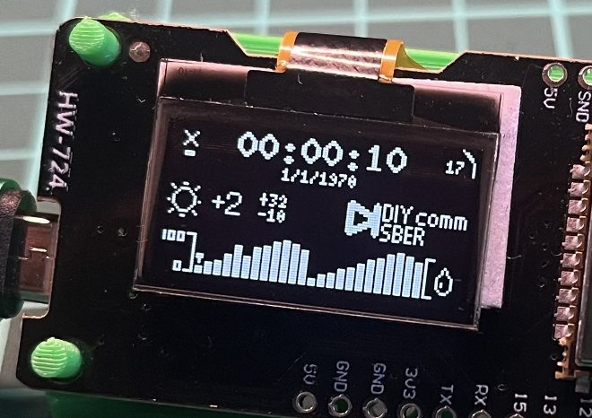
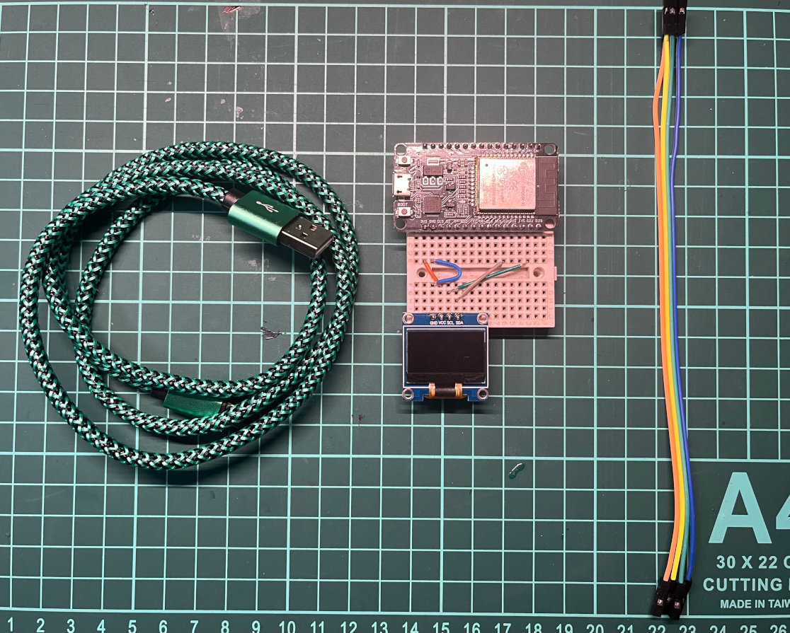
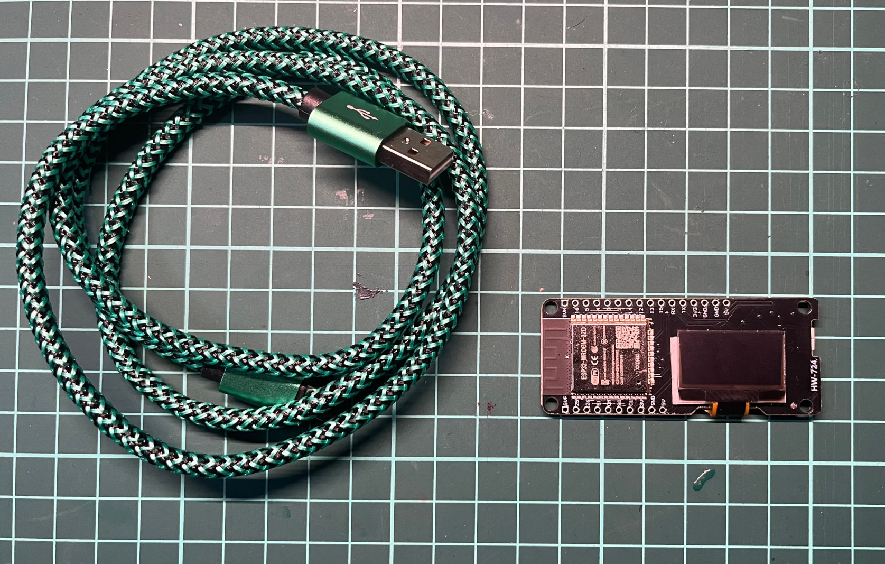
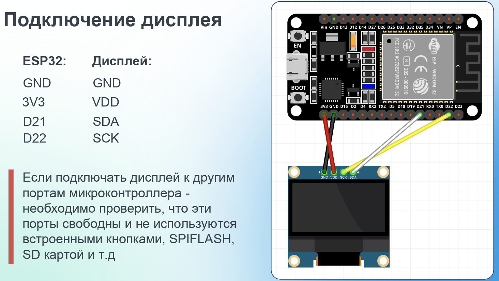
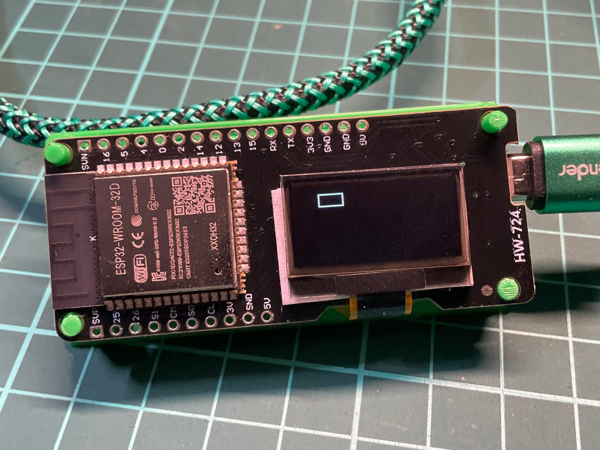
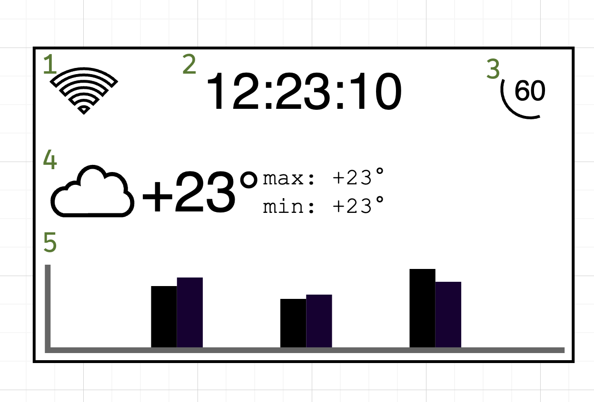

# esp32-weather-station



Простая метеостанция на esp32 + rust, которая показывают актуальную погоду с [open-meteo](https://open-meteo.com/en/docs)

# Необходимые материалы

- Ноутбук/ПК (Linux, MacOS, Windows) для разработки и прошивки МК
- Кабель USB для подключения к МК (ответная часть зависит от девкита)
- Экран PMOLED монохромный на базе контроллера **SSD1306**  
- Devkit на базе микроконтроллера ESP32
- WiFi точка доступа 2.4ГГц с выходом в интернет (для МК)

Купить или использовать можно любые девкиты и экраны, главное что бы 

- экран должен быть на базе **SSD1306** 
- devkit должен быть на базе **ESP32**

Так же необходимо найти и скачать распиновку для своего МК. Гуглится по ключевому слову pinout, например: `pinout ESP32-WROOM-32 NodeMCU`

Примеры комплектов:

## Экран и МК отдельно



> **Warning**  
> Экран и девкит может поставляться с незапаянными штырьковыми разъемами! Может потребоваться пайка

[OLED SSD1306](https://www.ozon.ru/product/oled-displey-0-96-128x64-i2c-belyy-945285571/?avtc=1&avte=4&avts=1731359337)

[ESP32](https://www.ozon.ru/product/esp32-devkit-38pin-kontroller-esp32-wroom-32-1712466151/?asb=4YstCflXD96uqMLauwoLdrpQV2di4mSfafcY9jjcj3o%253D&asb2=bk60acPFqJK_qYXImt6teQC9dRnWb5UyF6-MYuU-WDKcL4FCB2stRmCAlbGafX-QRJ-LY2GJUSmEM0_6cqnxh0jgrXC6epUfEvWqbu-kjzlD2rVar6v3axaYR6WVz9pyqY0gomrz9zUqoeSl8QrVqzW93XDENFbmviQw-9MTRck&avtc=1&avte=4&avts=1731359541&keywords=esp32)

[Макетная плата на 170+ точек](https://www.ozon.ru/product/bespaechnaya-maketnaya-plata-breadboard-170-tochek-1012687498/?asb=ZDxXko1pTvutL5%252Fnh0tgzzfF6WZARy%252FAldmVRp5dI28%253D&asb2=2m27FwpI6os8QJ2bUvzGYKKIc0au6Ac-TJsu2VdWU55Rsg-_DqC2XvKI9Pe-TAwisEFotJ8S3YYK2E_z6lcfiw&avtc=1&avte=4&avts=1731360479&keywords=breadboard)

[Провода перемычки Dupont](https://www.ozon.ru/product/provoda-peremychki-dupont-30-sm-3-vida-po-40-sht-mama-mama-papa-papa-papa-mama-dlya-arduino-1051231534/?asb=riLQ0aCCIN%252B6T6zq6UEbic8gPR18Wndf2Yszn2b3QT4%253D&asb2=FVEu6zkxrJzi6G3g_BwEPUEp0TL1_IzPCrGzr6LAkosND_sPccnNYwZmBDbbhaO0r6n_EZnOLJErxg414yEy_A&avtc=1&avte=4&avts=1731360540&keywords=провода+для+ардуино)


## МК вместе с экраном на плате



В этом комплекте ничего паять и подключать между собой не нужно т.к. все располагается на одной плате.

[Devkit ESP32 + OLED SSD1306](https://www.ozon.ru/product/modul-esp32-s-oled-displeem-1564880460/?asb=PgnFzODZfTizrkdcvDZqZNNEV5%252BCMd23%252F6bvhsValaQ%253D&asb2=gliD0Zr4VXqWYXjIFnckd8Jth5iSS29j_IE9QG8ZCA2v7imw1e6HkU1YJUozNnDuqBbLOfhjWbvyZAQI19PmGA&avtc=1&avte=4&avts=1731359481&keywords=esp32+oled)


# Настройка окружения

## 1 Установка rust 

```
https://rustup.rs
```

## Установка IDE: 

Устанавливаем vscode для своей операционной системы
```
https://code.visualstudio.com
```

а так же расширение для языка rust
```
https://code.visualstudio.com/docs/languages/rust
```


## Установка ESP32 SDK для Rust
Для компиляции и прошивки микроконтроллера необходимо установить ряд дополнительных утилит:  
*espflash* - работа с flash памятью и прошивка микроконтроллера
*ldproxy* - утилита для перенаправления аргументов линковщика (не используется пользователем напрямую).  
*espup* - утилита для установки тулчеинов (Xtensa Rust toolchain)  
*esp-idf* - Содержит API (библиотеки и исходный код) для доступа к перефирии МК + скрипты для работы с тулчеином.

Установка данных утилит выполняется один раз и используется для всех последующих проектов.  
При сборке проекта будет использоваться обычная команда `cargo run --release` и в большинстве случаев, ручной вызов этих утилит не требуется.

### ldproxy

```
cargo install ldproxy
```

### espflash
[репозиторий + документация](https://github.com/esp-rs/espflash/blob/main/espflash/README.md)

На linux машинах может потребоваться установка доп. пакета:
```
apt-get install libudev-dev
```

```
cargo install cargo-espflash
cargo install espflash
```

### espup 
https://github.com/esp-rs/espup
```
cargo install espup
espup install

. $HOME/export-esp.sh
```

### esp-idf
https://github.com/esp-rs/esp-idf-template#prerequisites

https://docs.espressif.com/projects/esp-idf/en/latest/esp32/get-started/linux-macos-setup.html#step-1-install-prerequisites


```
```

# Создание проекта

Что бы  вручную не создавать и конфигурировать проект, можно воспользоваться утилитой `cargo-generate`. `cargo-generate` - создаст проект с нужными настройками на базе репозитория-шаблона


```shell
# устанавливаем cargo-generate
cargo install cargo-generate

# переходим в директорию где будет храниться проект 
cd esp32-projects

# создаем проект на базе шаблона: https://github.com/esp-rs/esp-idf-template
cargo generate esp-rs/esp-idf-template cargo
```

`cargo-generate` предложит ввести название проекта и целевой микронтроллер. От advanced настройках можно отказаться:
```
Project Name: esp32-weather-station
Which MCU to target?: esp32
Configure advanced template options?: false
```

Переходим в директорию проекта и проверяем собирается наш проект или нет. Команда `cargo build` только соберет проект не прошивая МК.

```shell
cd esp32-weather-station
```

Командой `ls -la` посмотрим на структуру проекта, которую сгенирировал `cargo-generate`. 
  
```
   -  .
   - ├──  .cargo
     │  └──  config.toml
   - ├──  .embuild
     ├──  build.rs
     ├──  Cargo.lock
     ├──  Cargo.toml           - конфигурация rust проекта
     ├──  rust-toolchain.toml
     ├──  sdkconfig.defaults   - конфигурация Espressif IoT Development Framework
   - ├──  src
     │  └──  main.rs           - точка входа программы 
   - └──  target
```

Наиболее интересные файлы для нас это:  
`src/main.rs` - исходный код прошивки МК  
`Cargo.toml` - настройки проекта и библиотеки  
`sdkconfig.defaults` - настройки конфигурации SDK Espressif   


Проверим работу МК скомпилировав и отправив прошивку.  
В `src/main.rs` уже находится необходимая прошивка:
```rust 
fn main() {
    esp_idf_svc::sys::link_patches();
    esp_idf_svc::log::EspLogger::initialize_default();

    log::info!("Hello, world!");    
}
```
Встроенный логгер будет печатать всю информацию в serial.   


`cargo run --release` - скомпилирует и прошьет МК. Ключ `--release` применяет оптимизацию . Это превентивно помагает избежать ошибок связанных с нехваткой памяти в стеке или куче.
```
cargo run --release
```

Первая сборка проекта может происходить дольше обычного т.к. скачиваются необходимые тулчеины. 

Что бы иметь возможность прошить и читать читать логи, необходимо выбрать последовательный (serial) порт, к которому подключен МК. Примерное описание такого порта:
```
❯ /dev/cu.usbserial-0001 - CP2102 USB to UART Bridge Controller
```

После прошивки в логах будет примерно такие логи:
```
 (31) boot: ESP-IDF v5.1-beta1-378-gea5e0ff298-dirt 2nd stage bootloader
I (31) boot: compile time Jun  7 2023 07:48:23
I (33) boot: Multicore bootloader
I (37) boot: chip revision: v3.1
I (41) boot.esp32: SPI Speed      : 40MHz
I (46) boot.esp32: SPI Mode       : DIO
I (50) boot.esp32: SPI Flash Size : 4MB
I (55) boot: Enabling RNG early entropy source...
I (94) boot: End of partition table
I (279) cpu_start: Pro cpu start user code
I (280) cpu_start: cpu freq: 160000000 Hz
I (280) cpu_start: Application information:
I (283) cpu_start: Project name:     libespidf
I (388) main_task: Started on CPU0
I (398) main_task: Calling app_main()
I (398) esp32_weather_station: Hello, world!
I (398) main_task: Returned from app_main()
```

Что свидетельствует об удачной прошивке и работе МК.

Если при выборе последовательного порта произошел запрет доступа (`Permission denied`): 

```
[2024-12-01T13:25:22Z INFO ] Serial port: '/dev/ttyUSB0'
[2024-12-01T13:25:22Z INFO ] Connecting...
Error: espflash::serial_error

  × Failed to open serial port /dev/ttyUSB0
  ├─▶ Error while connecting to device
  ├─▶ IO error while using serial port: Permission denied
  ╰─▶ Permission denied
```

то необходимо выдать пользователю права на `tty` и `dialout`:

```
sudo usermod -a -G tty $USER
sudo usermod -a -G dialout $USER
```

и перезапустить компьютер


# Разработка

## Подключаем библиотеки 

Для дальнейшей работы с экраном и графикой нам необходимо включить в проект несколько библиотек. Для это надо в файле `Cargo.toml` в таблице `[dependencies]` добавить следующие следующие строки:

```toml
[dependencies]
log = { version = "0.4", default-features = false }
esp-idf-svc = { version = "0.49", default-features = false }

embedded-graphics = "0.8.1"  # рисование примитивов 
embedded-layout = "0.4.1"    # б
ssd1306 = "0.9.0"            # протокол работы с экраном 
chrono = { version = "0.4.38", features = ["serde"] } # дата и время
tinytga = "0.5.0"            # картинки в формате .tga
serde = { version = "1.0.203", features = ["derive"] } # дерево для ser/deser
serde_json = "1.0.120"       # 
embedded-svc = "0.28.0"
anyhow = "1.0.82"
```

`ssd1306` - протокол/драйвер для работы с экраном  
`embedded-graphics`, `embedded-layout`, `tinytga` - библиотеки для программного рендеренга примитивных геометрических фигур? текста и картинок  
`chrono` - работа с датой и временем  
`serde`, `serde_json` - сериализация/десериализация стуктур для. Необходимо для коммуникации с метео сервисом.

## Подключение дисплея 




> **Warning**  
> Внимательно проверьте подключение пинов МК к дисплею. Неправильное подключение может сломать МК

## Проверка экрана. Рисуем прямоугольник

С экраном микроконтроллер коммуницирует по шине I2C. МК выступает в качестве ведущего устройства, которое будет отвечать за команды, а экран за ведомое - устройство которое получает команды и в случае необходимости отвечает ведущему.

`let peripheral = Peripherals::take().unwrap()` - отвечает за получение всей перефирии (GPIO, SPI, I2C и т.д.) микроконтроллера.

Выбираем частоту, на которой будет работать шина, а так же выводы микроконтроллера, к которому подключены ведомые устройства 


```rust
use embedded_graphics::pixelcolor::BinaryColor;
use embedded_graphics::prelude::*;
use embedded_graphics::primitives::{PrimitiveStyle, Rectangle, StyledDrawable};

use esp_idf_svc::hal::i2c::*;
use esp_idf_svc::hal::prelude::*;

use ssd1306::{prelude::*, I2CDisplayInterface, Ssd1306};


fn main() {
    esp_idf_svc::sys::link_patches();
    esp_idf_svc::log::EspLogger::initialize_default();

    let peripheral = Peripherals::take().unwrap();

    let i2c_config = I2cConfig::new().baudrate(400u32.kHz().into());
    let screen_sda = peripheral.pins.gpio5;
    let screen_scl = peripheral.pins.gpio4;

    let i2c = I2cDriver::new(peripheral.i2c0, screen_sda, screen_scl, &i2c_config).unwrap();

    let interface = I2CDisplayInterface::new_custom_address(i2c, 0x3C);

    let mut display = Ssd1306::new(interface, DisplaySize128x64, DisplayRotation::Rotate0)
        .into_buffered_graphics_mode();

    display.init().unwrap();
    display.set_brightness(Brightness::BRIGHTEST).unwrap();

    let style1 = PrimitiveStyle::with_stroke(BinaryColor::On, 1);
    let rectangle = Rectangle::new(Point::new(20, 10), Size::new(20, 10));

    loop {
        display.clear_buffer();
        let _ = rectangle.draw_styled(&style1, &mut display);

        display.flush().unwrap();
    }
}
```

Компилируем и прошиваем `cargo run --release`.  
На дисплее должен отрисоваться прямоугольник.




# Разработка UI

## Макет графического интерфейса



- Состояние подключения Wi-Fi
- Время и дата
- Количество кадров в секунду
- Текущая, максимальная и минимальная температура на сегодняшний день
- Почасовый график вероятности осадков  

## Состояние приложения

Все состояние приложения, будет хранится с отдельной структуре. Пока микроконтроллер не подключен к wi-fi сети, структура будет заполнена мок-данными (фиктивные данные имитирующие реальные данные). Это удобно для тестов и отладки.

```rust
#[derive(Debug, Clone)]
struct ApplicationState {
    temperature_cur: i8,
    temperature_min: i8,
    temperature_max: i8,
    rain_propability: Vec<u8>,
    weather_condition: WeatherCondition,
    time: DateTime<Utc>,
    is_wifi_connected: bool,
}
```

## Рисование статуса

```rust
let angle_start = Angle::from_degrees(0.0 + (i as f32) * 6.0);
let angle_sweep = Angle::from_degrees(100.0);
let arc = Arc::new(Point::zero(), 16, angle_start, angle_sweep).align_to(
    &screen_area,
    horizontal::Right,
    vertical::Top,
);
arc.draw_styled(&style1, &mut display).unwrap();
let _ = Text::with_text_style(
    format!("{:02}", (1000.0f32 / dt.as_millis() as f32).round()).as_str(),
    arc.center(),
    MonoTextStyle::new(&FONT_4X6, BinaryColor::On),
    TextStyleBuilder::new()
        .alignment(Alignment::Center)
        .baseline(Baseline::Middle)
        .build(),
)
.draw(&mut display)
.unwrap();
```

## Рисование времени и даты 

```rust
let time_str = format!(
    "{:0>2}:{:0>2}:{:0>2}",
    info.time.hour(),
    info.time.minute(),
    info.time.second()
);
let time_text = Text::with_text_style(
    time_str.as_str(),
    Point::zero(),
    MonoTextStyle::new(&FONT_9X15_BOLD, BinaryColor::On),
    TextStyleBuilder::new()
        .alignment(Alignment::Center)
        .baseline(Baseline::Middle)
        .build(),
)
.align_to(&screen_area, horizontal::Center, vertical::Top);
time_text.draw(&mut display).unwrap()
let date_str = format!(
    "{}/{}/{}",
    info.time.day(),
    info.time.month(),
    info.time.year()
);
let _ = Text::with_text_style(
    date_str.as_str(),
    Point::zero(),
    MonoTextStyle::new(&FONT_4X6, BinaryColor::On),
    TextStyleBuilder::new()
        .alignment(Alignment::Center)
        .baseline(Baseline::Middle)
        .build(),
)
.align_to(
    &time_text.bounding_box(),
    horizontal::Center,
    vertical::TopToBottom,
)
.draw(&mut display)
.unwrap();
```

# Полезные ссылки

https://open-meteo.com/en/docs
https://docs.espressif.com/projects/arduino-esp32/en/latest/api/i2c.html

книга "The Rust on ESP Book" 
https://docs.esp-rs.org/book/introduction.html


# Draft

 
nightly or stable?

> переходим в директорию где будет храниться проект
переходим в директорию где будут храниться проекты


ошибка
```
error: failed to run custom build command for `esp-idf-sys v0.35.0`
Error: Could not install esp-idf
  Cloning into '/home/troxid/TmpProjects/esp32-weather-station-test1/.embuild/espressif/esp-idf/v5.2.2'...
  error: RPC failed; curl 92 HTTP/2 stream 0 was not closed cleanly: CANCEL (err 8)
  error: 610 bytes of body are still expected
  fetch-pack: unexpected disconnect while reading sideband packet
  fatal: early EOF
  fatal: fetch-pack: invalid index-pack output
  Error: Could not install esp-idf

  Caused by:
      command '"git" "clone" "--jobs=8" "--recursive" "--depth" "1" "--shallow-submodules" "--branch" "v5.2.2" "https://github.com/espressif/esp-idf.git" "/home/troxid/TmpProjects/esp32-weather-station-test1/.embuild/espressif/esp-idf/v5.2.2"' exited with non-zero status code 128
```
https://stackoverflow.com/questions/21277806/fatal-early-eof-fatal-index-pack-failed

git config --global core.compression 9 repack
